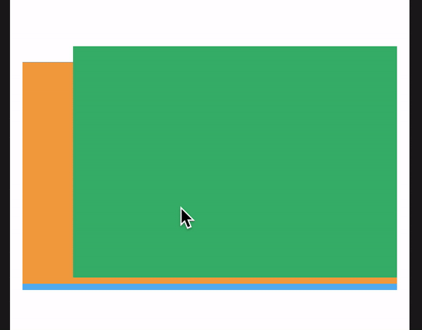

Swipable, customizable card stack view, Linkedin like card stack view based on UICollectionView. Cards UI




Сocoapods installation
------------------

Add in your `Podfile`:<br/>
```
pod 'HorizontalCardStack'
```

And in your `*.swift`:
```swift
import HorizontalCardStack
```


Manual installation
------------------

Add `DecorationViewAttributes.swift`,`HorizontalCardStackLayout.swift` into your Xcode project.


Usage start (see example project for more details)
-----
 Create UICollectionView with 'HorizontalCardStackLayout' collectionViewLayout


Additional features/options
-----	
1. Callback about top card changes:

  ```swift
func topCardWasChanged(_ index: Int)
  ```

1. Callback about card movements:
  ```swift
	func cardWasMoved(_ index: Int, isLeftDirection: Bool)
  ```

1. To customize left/right views
  ```swift
	updateDecorationViews
  ```

1. To freeze left/right movements
  ```swift
	func shouldCardBeMoved(_ isLeftDirection: Bool) -> Bool?
  ```


For more detail, see the sample project.

Contact
-------

 andrei.pitsko@gmail.com, julien.perrenoud@tispr.com, pradeep.burugu@tispr.com, pavel.batashou@tispr.com

License
-------
Apache License
                           Version 2.0. See LICENSE.txt
